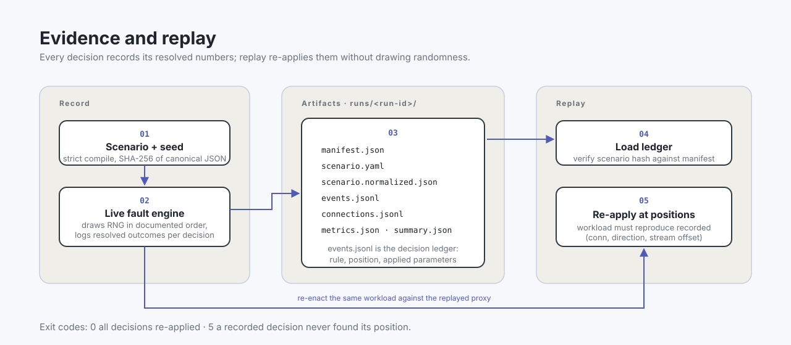
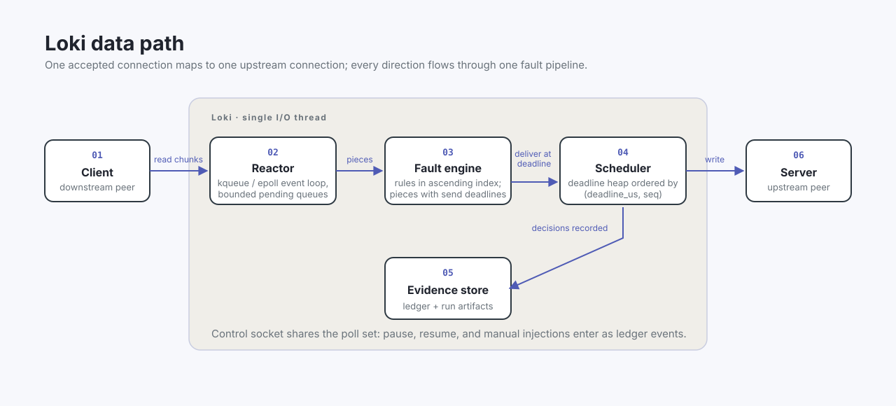

# Loki

[](LICENSE)


Loki is a deterministic hostile-network engine: a programmable TCP fault-injection proxy for testing networked systems under ugly transport behavior.

Point a client and a server through it, feed it a scenario and a seed, and it delays, throttles, fragments, reorders, corrupts, silences, or terminates traffic exactly as specified while recording every fault decision to an evidence directory you can replay later.

It exists for the failures that only appear when communication goes wrong: a reply that arrives 300 ms late, a stream shredded into 2-byte pieces, a connection reset mid-response, silence that never becomes an error.

Loki is pre-1.0 software under active development. V1 covers TCP proxying on a single I/O thread, IPv4 and IPv6, byte-stream agnostic, with no protocol awareness. APIs and evidence formats may still change across the 0.x series.

## Quickstart

Requirements: CMake 3.25+, a C++20 compiler, Make. Catch2 v3.8.1 is fetched at configure time and is the only external dependency.

```sh
./scripts/build.sh

# terminal 1: any echo server or your real service
python3 -m http.server 8080

# terminal 2: run Loki between client port 9000 and server port 8080
./build/default/src/cli/loki run scenarios/latency.yaml --seed 123
```

With `scenarios/latency.yaml` pointed at those ports, every connection through `127.0.0.1:<listen>` gets 50 ms one-way delay with 20 ms jitter in both directions. Stop with Ctrl-C; a full evidence directory lands under `runs/<run-id>/`.

## What it does

One accepted downstream connection maps to one upstream connection. Each direction flows through a fault pipeline compiled from a YAML scenario. Rules match on direction, elapsed time, byte counts, event counts, connection ordinals, probability, and occurrence caps, then inject exactly one fault:

| fault | effect |
| --- | --- |
| `latency` | uniform or normally distributed send delay |
| `bandwidth` | token-bucket throughput cap with burst allowance |
| `fragment` | shreds chunks into pieces of random size |
| `coalesce` | accumulates bytes until size or deadline, emits one piece |
| `reorder` | holds up to N pieces, releases them permuted |
| `duplicate` | replicates pieces |
| `corrupt` | flips or overwrites a byte at an absolute pristine offset |
| `blackhole` | discards traffic or stops reading to stall the sender via backpressure |
| `reset`, `fin`, `half_close` | lifecycle faults: RST teardown, EOF relay, directional shutdown |
| `connect_delay`, `refuse`, `accept_stall`, `idle_timeout` | connection-phase faults |

The design contract is determinism. One RNG stream per run seeded from the scenario seed; draws happen only inside the mutator in documented order; events are ordered by `(deadline_us, seq)`; poller batches are processed sorted by `(conn ordinal, fd kind)`. Wall-clock timestamps are recorded but never affect decisions. Same seed plus same observed workload means the same fault schedule, and every decision records its resolved numeric outcomes so replay never re-draws randomness.

A note on naming honesty: Loki operates on application byte streams, not packets. It says discard, freeze, and reorder, never packet loss.

## Measured snapshot

Loopback TCP against a Python echo server, Apple M1, Apple Clang 21.0.0, kqueue backend, uncommitted working tree at measurement time. Full methodology and raw rounds in [docs/BENCHMARKS.md](docs/BENCHMARKS.md); harness is [`scripts/bench.py`](scripts/bench.py).

| case | configured | measured |
| --- | --- | --- |
| Passthrough, direct client-server | - | 2100 MB/s median |
| Passthrough through Loki, no rules | - | 63 MB/s median |
| Latency fault RTT (50 ms ± 20 ms per direction) | nominal 100 ms, bounds [60, 180] ms | median 107.2 ms, range [71.8, 139.7] ms |
| Bandwidth fault (50 KiB/s rate, 8 KiB burst) | 50 KiB/s sustained | 50 KiB/s achieved |

The throughput gap is the cost of the determinism contract on a single I/O thread: every chunk crosses the mutator and the decision-ledger path. The fault rows are the accuracy that matters - configured rates and delays hold.

## Usage

```sh
loki validate SCENARIO.yaml                 # strict validation only
loki run SCENARIO.yaml [--seed N]           # live proxy until SIGTERM/SIGINT
    [--listen ADDR] [--upstream ADDR] [--runs-dir DIR]
    [--full-ledger | --ledger-counts | --ledger-sample N]
loki replay RUN_DIR [--check-only]          # re-apply recorded decisions
loki inspect RUN_DIR [--summary | --connections | --events --tail N]
loki ctl RUN_DIR_OR_SOCK CMD [CONN]         # pause, resume, status, inject
```

Every run produces `manifest.json`, `scenario.yaml`, `scenario.normalized.json`, `events.jsonl`, `connections.jsonl`, `metrics.json`, and `summary.json` under `runs/<run-id>/`. The normalized scenario is canonical integer-only JSON with recursively sorted keys, SHA-256 hashed into the manifest. Manual control-socket injections land in the ledger like rule firings.



Exit codes: `0` ok, `2` usage error, `3` scenario validation failure, `4` runtime failure, `5` replay mismatch.

### Scenario example

```yaml
version: 1
seed: 7
listen: 127.0.0.1:17611
upstream: 127.0.0.1:17610

rules:
  - name: shred
    when:
      direction: client_to_server
    inject:
      fragment:
        min: 1
        max: 8
```

The parser accepts a deliberately small block-style YAML subset and rejects tabs, flow style, anchors, duplicate keys, unknown keys anywhere, and anything beyond the first document. See AGENTS.md for the complete schema, duration syntax, and match semantics.

## How it works



A single-threaded reactor owns all sockets, a deadline heap scheduler, the fault engine, evidence writers, and a Unix-domain control plane. Per chunk, rules evaluate in ascending index: shape faults transform the piece list, timing faults stamp send deadlines where later stamps win so traffic never accelerates, and silence faults queue side effects immediately. Every pending queue is bounded by `pending_bytes_per_direction`; when full, the reactor stops reading the source socket until drained. Transport backends are platform-gated behind one interface: kqueue on macOS/BSD, epoll on Linux.

## Development

```sh
./scripts/build.sh                        # configure default preset, build, ctest
cmake --preset asan && cmake --build --preset asan && ctest --preset asan
```

Ten Catch2 test binaries cover util, config parsing, transport, scheduler, reactor, faults, evidence, replay, control, and integration. The integration suite runs the real binary against a live echo server and checks byte-identical passthrough, fault behavior bounds, evidence completeness, deterministic ledger reproduction, and self-terminating ledger replay.

Source layout:

```text
include/loki/    frozen contracts: types, rng, json, scenario, scheduler,
                 poller, engine, evidence, replay, control, reactor
src/config/      YAML parser, validator, compiler
src/transport/   poller backends, socket utils, endpoint resolution
src/scheduler/   deadline heap
src/reactor/     event loop, registry, backpressure
src/faults/      live fault engine
src/evidence/    run store, writers
src/replay/      ledger loader, ledger engine
src/control/     UDS control server
src/cli/         loki binary verbs
tests/<area>/    per-area Catch2 binaries
```

AGENTS.md is the engineering guide: invariants, scenario schema, package boundaries, and glossary.

## Limitations

V1 scope: TCP only, single I/O thread, no TLS, no UDP, no protocol awareness. Reordering happens between proxied chunks, not network packets. Unix socket paths are capped at about 100 characters on macOS, so keep runs directories short. Seed replay reproduces schedules only when the observed event order repeats; ledger replay consumes positions from real traffic, so it needs the recorded workload re-enacted against it.

## License

[MIT](LICENSE)
